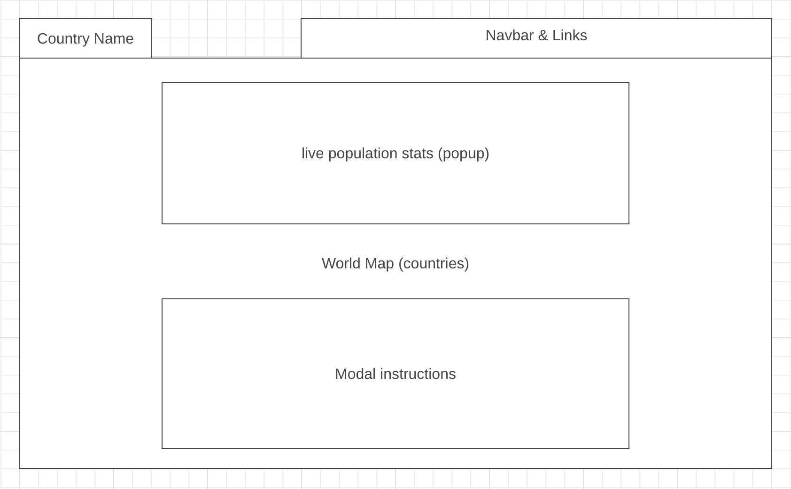

# Background

GeoQuest is a vanilla JS web application that renders an interactive world map. Users can click on a specific country on the map, and upon clicking, a modal window will appear displaying detailed information about that country. The information includes the country's population, flag, and the primary language spoken. This project aims to provide an engaging and educational experience, allowing users to explore and learn about different countries and their key statistics by interacting with the map. It serves as a user-friendly platform for accessing geographical and demographic data in an interactive and visually appealing manner.

# In GeoQuest, users will be able to:

Explore a dynamic and interactive world map where they can click on countries to learn more about them.

Clicking on a country will open a modal window with details about that country, including population, flag, and primary language spoken.

Clicking on a country will zoom in on that country creating a bound box displaying that countries borders.

Users can test their world knowledge with a quiz feature that prompts questions about a countries location or spoken language.

Search for specific countries using a search bar for quick access to information.

# In addition, this project will include:

An included README file providing clear instructions on how to use the application and integrate it into other projects.

A navbar which includes links to my github, linkedin, and other works.

Links to Additional Information: Links to additional resources or references for users who wish to explore more about the world's countries.

# Wireframe

# Technologies, Libraries, APIs

D3
Countries RestfulAPI

# Implementation Timeline

Friday Afternoon & Weekend: research d3, bulding a map, and using modal popups

Monday: have a working map rendered that is clickable

Tuesday: have the clicked country populate with info modal

Wednesday : implement any extra features, maybe change to globe

Thursday Morning: make sure all features work as expected
